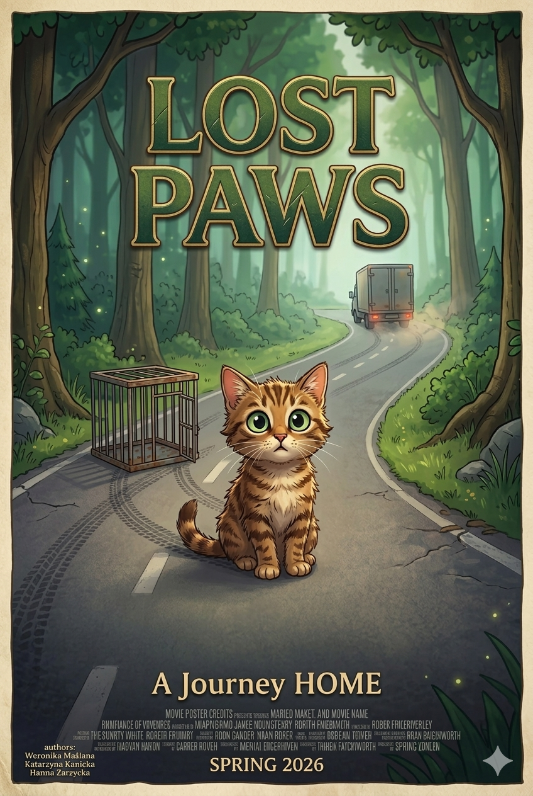
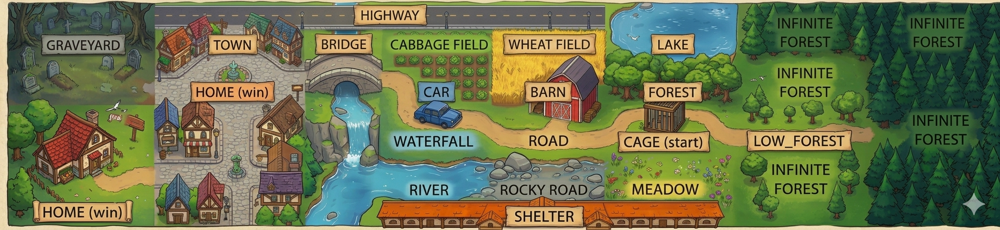
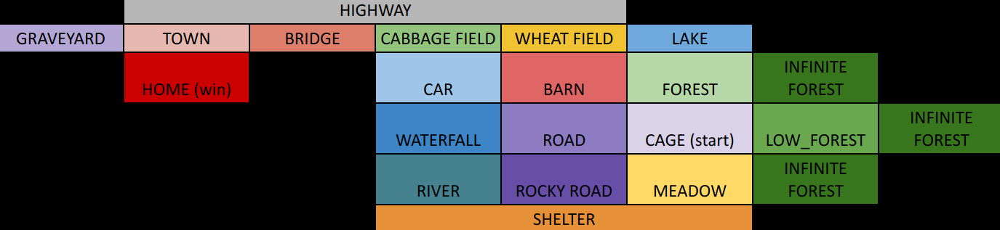

# PARP-LostPaws



## Authors

Weronika Maślana
Katarzyna Kanicka
Hanna Zarzycka

## Smalltalk version
smalltalk-3.2.5

## Topic of the story:

Muffin, a fat and very lazy house cat, was lying in the warm sun, happily baking like a loaf of bread.

Suddenly, someone picked her up.
Before she could complain, she was placed inside a metal cage and loaded into the back of a truck. Around her were many other cages filled with nervous animals.

After many long hours, the truck turned onto a rough, bumpy road. The cages rattled and slid across the floor.

Then — **BANG!**

The truck's back door swung open. Muffin’s cage rolled out of the truck and into the tall grass by the road.

The truck disappeared into the distance.

Muffin pushed the cage door open with her paw and stepped outside.

She was free.

But one question remained:

**How will she find her way home?**

## Task:

write adventure, text based game in:

- prolog (W)
- huskel (K)
- smalltalk (H)

## Prolog launch

```
swipl
[lostPaws].
start.
```

---

# === SPOILERS BELOW! ===

## Map



## Walkthrough

**A Short Guide on How to Finish the Game and Bring Muffin Back Home**

---

### 1. Escape from the Cage Area

- Go **south to meadow**.
- `take(white_rock).` – under the rock you will find a **hat**.
- Go **west to rocky_road**.

---

### 2. Solve the Stone Puzzle

- On **rocky_road**, arrange the letters into the word:

```
shelter
```

- You will receive a **shell** and a clue about the **shelter**
  _(do not go there — it is a bad ending)._

---

### 3. Build the Totem at the Waterfall

Go:

- `w` → river
- `n` → waterfall

You must have:

- `brick`
- `white_rock`
- `cool_pebble` (`search(river).`)
- `shell`

Bring the stones to the **waterfall** and arrange them **from the heaviest to the lightest** using `arrange` and only the **first letters** of the items:

```
b,w,c,s
```

A **pipe** will wash up from the water.

---

### 4. Scare Away the Crows on the Cabbage Field

You need:

- `big_stick`
- `small_stick`
- `hay`
- `hat`

In **wheat_field**, build a scarecrow:

- `big_stick` with `hay` → `frame`
- `small_stick` with `frame` → `headless_man`
- `hat` with `headless_man`

This creates a **scarecrow**, and the crows will fly away.

---

### 5. Build Stairs at the Bridge to Jump Over the Gate

Collect the items:

- `pipe`
- `broken_stool`
- `cardboard_box`
- `cage`

Build them:

- `pipe` with `broken_stool` → `stool`
- `cardboard_box` with `cage` → `tower`
- `tower` with `stool`

This creates **stairs**, allowing you to enter the town.

---

### 6. Get Rid of the Dog

- In the **graveyard** you will find:

```
bone
```

- While in **town**, throw it to the dog (`drop(bone).`).

---

### 7. Distract the Eagle

- Bring a **fish** to the town (for example from the box in the forest).
- Drop the fish in **town**.

---

### 8. Go South to Your Home and Win

---

💡 **Tip:**
Remember to **collect and eat fish or rodents along the way** so Muffin doesn’t collapse from exhaustion.

---

## Prolog - win sequence (87 steps)



```
s.
take(white_rock).
w.
arrange(s,h,e,l,t,e,r).
take(shell).
w.
search(river).
take(cool_pebble).
n.
drop(cool_pebble).
drop(shell).
drop(white_rock).
e.
n.

search(brick).
take(tiny_mouse).
eat(tiny_mouse).
take(brick).
s.
w.
drop(brick).
arrange(b,w,c,s).
search(pipe).
take(herring).
eat(herring).
take(pipe).

e.
attach(pipe, broken_stool).
e.
s.

search(hat).
take(gerbil).
eat(gerbil).
take(hat).
n.
e.
take(small_stick).
search(branch).
take(squirel).
eat(squirel).
w.
n.
search(cardboard_box)
take(cod).
eat(cod).
take(big_stick).

show_mouth.  #you should have: hat, big_stick and small_stick

w.
n.
search(hay).
attach(big_stick, hay).
attach(small_stick, frame).
attach(hat, headless_man).
take(brown_mouse).
eat(brown_mouse).

s.
e.
take(cardboard_box).
s.
take(cage).
w.
take(stool).

n.
n.
w.
w.
drop(cage).
drop(cardboard_box).
search(cardboard_box).
take(mackerel).
eat(mackerel).
search(cardboard_box).
take(roach).
take(cardboard_box).
attach(cardboard_box, cage).
attach(stool, tower).

w.
take(rat).
eat(rat).
w.
take(bone).

e.
drop(bone).
drop(roach).
s.
halt.
```
